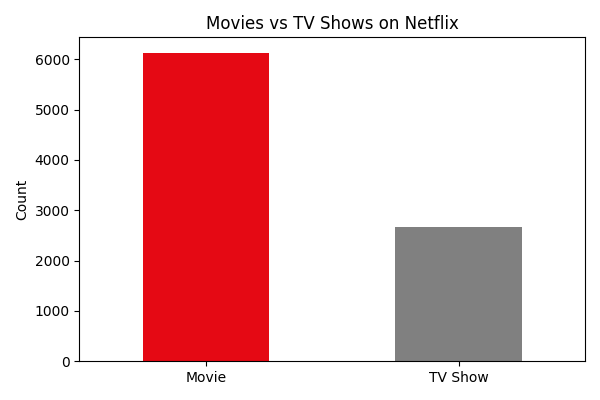
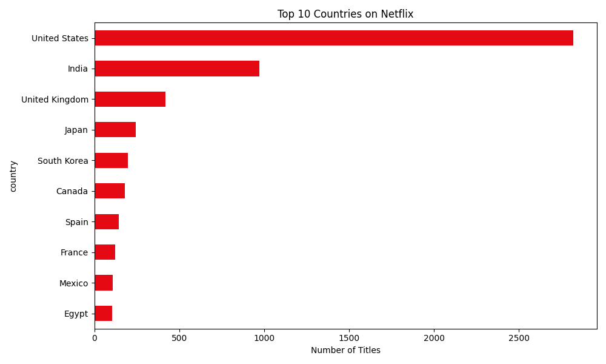

# Netflix Content Analysis

Exploratory data analysis on Netflix's content library to understand 
what kind of content they have, where it comes from, and who it's for.

## Tools
- Python — pandas, matplotlib
- SQL — DB Browser for SQLite
- Dataset: Netflix Movies and TV Shows (Kaggle, 8,807 titles)

## Findings

**Content split**  
Netflix has significantly more movies (6,131) than TV shows (2,676) — 
roughly 70/30. It's primarily a movie platform.

**Geography**  
The US dominates with 2,818 titles. India is second with 972 but 
that's still less than a third of US output. Most content comes from 
English-speaking countries.

**Data quality**  
30% of titles have no director listed. Something to keep in mind 
if doing any director-level analysis.

**Content ratings**  
TV-MA is by far the most common rating (3,207 titles). Netflix 
clearly targets adult audiences rather than families.

**Average movie length**  
100 minutes.

## Charts

## Files
- `analysis.py` — full Python analysis
